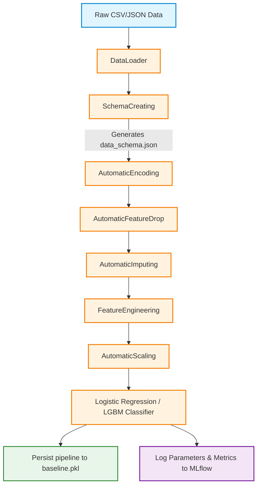

# 🏦 Automated Credit Scoring Pipeline

[](https://www.python.org/)
[](https://scikit-learn.org/)
[](https://github.com/microsoft/LightGBM)
[](https://mlflow.org/)
[]()

An end-to-end automated machine learning pipeline built to ingest, preprocess, engineer features, and train models for Credit Risk Assessment. The pipeline is designed specifically to handle highly imbalanced credit datasets (approx. 8% default rate) and track all preprocessing configurations and model metrics via MLflow.

---

## 📊 Pipeline Workflow

Below is the workflow showing how raw data flows through custom Scikit-learn transformers to build the final model:



---

## 📁 Project Structure

Below is the layout of the project, including links to key source files and configuration items:

```text
├── config/
│   └── data_schema.json       # Inferred data types schema configuration
├── models/
│   └── baseline.pkl           # joblib binary of the trained pipeline
├── notebooks/                 # Jupyter Notebooks for EDA & research
├── raw_data/                  # Directory for raw CSV/JSON datasets (Ignored by Git)
├── src/
│   ├── data_ingestion.py      # Data loading components
│   ├── data_preprocessing.py  # Custom transformers (Encoding, Imputing, Dropping, Scaling)
│   ├── features.py            # Business logic features (Feature Engineering)
│   └── train.py               # Pipeline orchestration & MLflow tracking
├── .gitignore                 # Specifies files/directories to be ignored by Git
├── mlflow.db                  # Local SQLite database storing MLflow runs
├── requirements.txt           # Python library dependencies
└── test-code.py               # Simple test entrypoint script
```

### 🔗 Quick Navigation Links
* 📂 **Configuration & Data**:
  * [data_schema.json](file:///c:/Credit%20Scoring%20Project/config/data_schema.json) - Data type schema definition.
* 📂 **Source Code**:
  * [data_ingestion.py](file:///c:/Credit%20Scoring%20Project/src/data_ingestion.py) - Data loading utilities.
  * [data_preprocessing.py](file:///c:/Credit%20Scoring%20Project/src/data_preprocessing.py) - Custom pipeline transformers.
  * [features.py](file:///c:/Credit%20Scoring%20Project/src/features.py) - Domain-specific feature engineering.
  * [train.py](file:///c:/Credit%20Scoring%20Project/src/train.py) - Pipeline configuration, training, and tracking.
* 📂 **Scripts & Environment**:
  * [test-code.py](file:///c:/Credit%20Scoring%20Project/test-code.py) - Script to test and run training.
  * [requirements.txt](file:///c:/Credit%20Scoring%20Project/requirements.txt) - Dependency list.

---

## 🛠️ Detailed Component & Class Documentation

### 1. Data Ingestion
* **Component File**: [data_ingestion.py](file:///c:/Credit%20Scoring%20Project/src/data_ingestion.py)

#### [DataLoader](file:///c:/Credit%20Scoring%20Project/src/data_ingestion.py#L7)
* **Purpose**: Safely loads datasets in CSV and JSON formats with memory-safe defaults.
* **Internal Logic**:
  * Employs `pathlib.Path` to verify file existence and checks file size (`st_size == 0`) to prevent loading empty files.
  * Supports flexible `**kwargs` parameters (such as `nrows`), allowing the system to read only a fraction of a massive dataset to build schema mappings without loading gigabytes of data into RAM.

---

### 2. Preprocessing & Custom Transformers
* **Component File**: [data_preprocessing.py](file:///c:/Credit%20Scoring%20Project/src/data_preprocessing.py)

#### [MissingValueTracker](file:///c:/Credit%20Scoring%20Project/src/data_preprocessing.py#L13)
* **Purpose**: Performs fast analysis of missing data ratio in each column and classifies the missing-risk level.
* **Internal Logic**:
  * Uses vectorized Pandas computations (`df.isnull().mean() * 100`) to compute missing percentages efficiently.
  * Leverages binary search (`bisect.bisect_left`) against a risk threshold dictionary to categorize risk levels:
    * **Low**: $\le 5\%$
    * **Considerable**: $\le 20\%$
    * **High**: $\le 50\%$
    * **Danger**: $\le 100\%$

#### [SchemaCreating](file:///c:/Credit%20Scoring%20Project/src/data_preprocessing.py#L135)
* **Purpose**: Analyzes raw data columns to dynamically infer data types and categorization rules, saving them to [data_schema.json](file:///c:/Credit%20Scoring%20Project/config/data_schema.json).
* **Internal Logic**:
  * Reads a configurable number of preview rows (default: `1000`).
  * Classifies features into `numerical_column`, `one_hot_column`, or `ordinal_column`.
  * **Cardinality Rule**: Categorical features with unique values $\le \text{cardinality\_threshold}$ (default: `5`) are routed to One-Hot Encoding; features with higher cardinality are routed to Ordinal Encoding.
  * Automatically excludes ID and Target columns (`SK_ID_CURR`, `TARGET`) to prevent target leakage.

#### [SchemaLoading](file:///c:/Credit%20Scoring%20Project/src/data_preprocessing.py#L269)
* **Purpose**: Utility class that opens the [data_schema.json](file:///c:/Credit%20Scoring%20Project/config/data_schema.json) file and returns a structured dictionary for downstream transformers.

#### [AutomaticEncoding](file:///c:/Credit%20Scoring%20Project/src/data_preprocessing.py#L80)
* **Purpose**: Custom Scikit-learn transformer that applies One-Hot Encoding and Ordinal Encoding dynamically based on the generated schema.
* **Internal Logic**:
  * **One-Hot Encoding**: Instantiated with `handle_unknown="ignore"` and `sparse_output=False`. It automatically renames generated dummy columns (`get_feature_names_out`) and concatenates them back to the DataFrame while dropping the raw column.
  * **Ordinal Encoding**: Instantiated with `handle_unknown="use_encoded_value"` and `unknown_value=-1` to prevent crashes when encountering unseen labels in the test or production datasets.

#### [AutomaticFeatureDrop](file:///c:/Credit%20Scoring%20Project/src/data_preprocessing.py#L178)
* **Purpose**: Drops useless columns containing high missing values unless they possess high predictive power.
* **Internal Logic (Pipeline-Safe)**:
  * **Feature Importance Assessment**: Fits a fast `LGBMClassifier` (50 estimators) in the `fit()` method and extracts feature importances. To ensure scale-invariance, it normalizes importances:
    $$\text{Normalized Importance}_i = \frac{\text{importance}_i}{\sum_{j} \text{importance}_j}$$
  * **Drop Rule**: In `fit()`, it calculates the missing value ratio. If a feature's missing ratio $>50\%$ (default) AND its normalized importance is below the `importance_threshold`, it is added to a local `self.feature_dropped` list.
  * **No Data Leakage / Consistency**: Inside `transform()`, it drops the pre-calculated columns in `self.feature_dropped` if they exist. No missing values or model importances are computed during `transform()`, ensuring the train and test shapes are always identical.

> [!NOTE]
> Out of pipeline steps, `AutomaticFeatureDrop` protects the model's integrity by removing highly sparse columns while guarding against dropping rare, highly predictive attributes.

#### [AutomaticImputing](file:///c:/Credit%20Scoring%20Project/src/data_preprocessing.py#L40)
* **Purpose**: Automatically imputes missing values based on statistical distribution characteristics.
* **Internal Logic**:
  * **Categorical Columns**: Replaces missing values with the **Mode** (most frequent category).
  * **Numerical Columns**: Computes the absolute skewness value ($\left|\text{skewness}\right|$):
    * If $\text{skewness} \le 0.5$ (normally distributed data): Imputes using the **Mean**.
    * If $\text{skewness} > 0.5$ (skewed data): Imputes using the **Median** to avoid bias caused by outliers.
  * Calculates values during `fit()` and applies them via `.fillna()` during `transform()`.

#### [AutomaticScaling](file:///c:/Credit%20Scoring%20Project/src/data_preprocessing.py#L220)
* **Purpose**: Scales numerical features dynamically based on skewness and the presence of outliers.
* **Internal Logic**:
  * **Outlier Detection**: Uses the Interquartile Range (IQR):
    $$\text{IQR} = Q_3 - Q_1$$
    $$\text{Lower Bound} = Q_1 - 1.5 \times \text{IQR}$$
    $$\text{Upper Bound} = Q_3 + 1.5 \times \text{IQR}$$
    Values outside these bounds are marked as outliers.
  * **Scaler Selection Rules**:
    * If **Outlier Percentage $> 1\%$**: Fits `RobustScaler` (resistant to outliers as it scales based on median and quantiles).
    * If **Outlier Percentage $\le 1\%$** AND **Skewness $\le 0.5$**: Fits `StandardScaler` (best for normally distributed features).
    * If **Outlier Percentage $\le 1\%$** AND **Skewness $> 0.5$**: Fits `MinMaxScaler` (scales bounded values within $[0, 1]$).

---

### 3. Feature Engineering
* **Component File**: [features.py](file:///c:/Credit%20Scoring%20Project/src/features.py)

#### [FeatureEngineering](file:///c:/Credit%20Scoring%20Project/src/features.py#L5)
* **Purpose**: Applies domain-specific feature engineering rules for credit scoring models.
* **Internal Logic**:
  * Creates `credit_income_ratio` representing total income divided by the credit amount:
    $$\text{Credit-Income Ratio} = \frac{\text{AMT\_CREDIT}}{\text{AMT\_INCOME\_TOTAL}}$$
  * Safely checks for the existence of columns before applying math operations to avoid crashes if prior steps dropped the columns.

---

### 4. Training Pipeline
* **Component File**: [train.py](file:///c:/Credit%20Scoring%20Project/src/train.py)

#### [TrainingPipeline](file:///c:/Credit%20Scoring%20Project/src/train.py#L11)
* **Purpose**: Bundles data loading, splitting, preprocessing steps, engineering, model training, and MLflow logging into a unified pipeline.
* **Internal Logic**:
  * Splits raw data into train/test subsets (`test_size=0.2`).
  * Stacks the custom transformers into an `sklearn.pipeline.Pipeline`.
  * **Class Imbalance Solution**: Employs `class_weight="balanced"` in the estimator (e.g., `LogisticRegression` or `LGBMClassifier`) to adjust loss penalties inversely proportional to class frequencies, countering the severe class imbalance (~8% defaults).
  * **Logging (MLflow)**: Connects to a local SQLite database (`sqlite:///mlflow.db`). Logs metrics (Precision, Recall, F1, and ROC-AUC) along with hyperparameters (skewness, outlier percentage, and classification parameters) to the tracking dashboard.

> [!IMPORTANT]
> The target variable default rate is extremely low (~8%). To prevent dummy classifier behaviors, always keep `class_weight="balanced"` or utilize custom threshold tuning.

---

## ⚡ Getting Started & Execution

### 1. Requirements & Dependencies
Ensure Python 3.8+ is installed. Install the package requirements:
```bash
pip install -r requirements.txt
```
*(Make sure `pandas`, `numpy`, `scikit-learn`, `lightgbm`, `mlflow`, `joblib`, and `pydantic` are listed/installed)*

### 2. Running the Training Pipeline
Run the entry point file to load datasets, train the pipeline, and log the results:
```bash
python test-code.py
```

### 3. Visualizing Metrics with MLflow
Start the MLflow tracking UI to compare runs, parameters, and performance metrics:
```bash
mlflow ui --backend-store-uri sqlite:///mlflow.db
```
Open [http://localhost:5000](http://localhost:5000) in your browser.