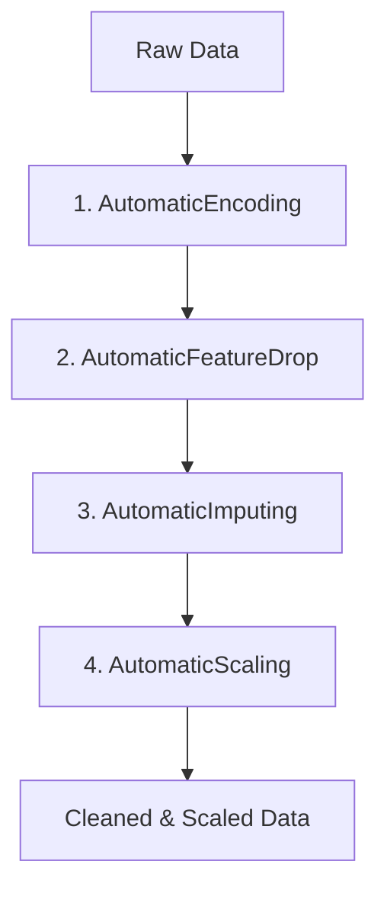

# Nhật Ký Phát Triển Dự Án Credit Scoring - Ngày 10/06/2026

Bản ghi chép này lưu trữ toàn bộ các công việc, các class đã xây dựng, các lỗi logic đã sửa và kiến trúc pipeline hoàn chỉnh đã đạt được trong ngày hôm nay.

---

## 1. Các thành phần mã nguồn đã hoàn thiện

### [data_ingestion.py](file:///c:/Credit%20Scoring%20Project/src/data_ingestion.py)
*   **DataLoader**: 
    *   Tối ưu hóa hàm `load_csv` hỗ trợ truyền tham số động (`**kwargs` như `nrows` để tránh quá tải bộ nhớ).
    *   Thêm phương thức `load_json` để đọc cấu hình/schema từ file JSON.
    *   Thêm phương thức `load_json_to_df` để tải tệp dữ liệu JSON thành DataFrame.

### [data_preprocessing.py](file:///c:/Credit%20Scoring%20Project/src/data_preprocessing.py)
*   **MissingValueTracker**:
    *   Vector hóa việc tính toán tỷ lệ khuyết thiếu bằng Pandas (`df.isnull().mean() * 100`), tăng tốc độ xử lý gấp nhiều lần.
    *   Phân loại rủi ro khuyết thiếu thành các nhóm (Low, Considerable, High, Danger).
*   **SchemaCreating**:
    *   Tự động phân tích và phân nhóm cột thành `numerical_column`, `one_hot_column`, và `ordinal_column`.
    *   **Tự động loại trừ** cột ID (`SK_ID_CURR`) và cột Target (`TARGET`) khỏi danh sách xử lý đặc trưng.
*   **AutomaticEncoding**:
    *   Tự động mã hóa biến phân loại bằng `OneHotEncoder(handle_unknown="ignore")` và `OrdinalEncoder(handle_unknown="use_encoded_value")`.
    *   Sửa lỗi thiết kế cũ (chia sẻ chung đối tượng encoder dẫn đến ghi đè trạng thái) bằng cách huấn luyện các bộ mã hóa riêng biệt cho từng cột và lưu trữ vào từ điển `self.onehot_encode_` và `self.ordinal_encode_`.
*   **AutomaticFeatureDrop** (AI-based Feature Dropper):
    *   Sử dụng mô hình **LightGBM Classifier** để tính toán độ quan trọng của đặc trưng (`feature_importances_`).
    *   Thiết lập cơ chế lọc thông minh: Chỉ xóa những cột có tỷ lệ missing > 50% **NẾU** cột đó có độ quan trọng dưới ngưỡng `importance_threshold`. Các cột quan trọng sẽ được bảo vệ (whitelist).
*   **AutomaticImputing**:
    *   Tự động điền khuyết thiếu dựa trên phân phối đặc trưng: Điền bằng **Mean** nếu phân phối chuẩn, điền bằng **Median** nếu phân phối lệch, điền bằng **Mode** đối với biến phân loại.
*   **AutomaticScaling**:
    *   Tự động chuẩn hóa biến số: Sử dụng **RobustScaler** cho các cột có chứa Outliers (> 1%), sử dụng **StandardScaler** cho các cột có phân phối chuẩn và **MinMaxScaler** cho các cột phân phối lệch không chứa Outliers.

---

## 2. Kiến trúc Pipeline Tiền Xử Lý Dữ Liệu Hoàn Chỉnh

Pipeline được xây dựng và chạy tuần tự thông qua `sklearn.pipeline.Pipeline` với thứ tự tối ưu sau:

---

## 3. Các lỗi logic & Cú pháp quan trọng đã tìm ra và khắc phục

1.  **Lỗi `.append()` với list trong schema**: Sửa thành `.extend()` để tránh tạo ra danh sách lồng nhau (`list of lists`), giúp vòng lặp so sánh cột chạy đúng.
2.  **Lỗi ghi đè trạng thái Encoder**: Thay vì dùng chung một instance encoder cho tất cả các cột, ta đã chuyển sang khởi tạo mới encoder riêng cho từng cột bên trong vòng lặp.
3.  **Lỗi gán `inplace=True`**: Trong Pandas, viết `x = x.drop(..., inplace=True)` sẽ gán biến `x = None`. Lỗi này được sửa bằng cách sử dụng `x = x.drop(...)` không có `inplace`.
4.  **Lỗi độ ưu tiên toán tử và từ khóa `or` trên Pandas Series**: 
    *   Thay thế ký tự `|` (bitwise) có độ ưu tiên cao bằng từ khóa `or` đối với các điều kiện đơn lẻ.
    *   Ngược lại, sửa lỗi viết `or` khi so sánh hai mảng Series (gây lỗi Ambiguous) thành cú pháp `((x[col] < lower) | (x[col] > upper))` chuẩn của Pandas.
5.  **Lỗi rò rỉ dữ liệu khuyết thiếu (Missing Ratio vs Fraction)**: Nhân tỷ lệ khuyết thiếu tính toán được với `100` để khớp với ngưỡng phần trăm (ví dụ: `50.0`) thay vì so sánh phân số dạng `0.5`.
6.  **Lỗi KeyError các cột đã bị xóa trước đó**: Trong class `AutomaticScaling`, thêm kiểm tra `if column not in x.columns: continue` để bỏ qua các cột đã bị class `AutomaticFeatureDrop` dọn dẹp trước đó.

---

## 4. Các bước tiếp theo cần triển khai

- [ ] Phân chia tập dữ liệu huấn luyện thành `X_train`, `X_test`, `y_train`, `y_test` trước khi fit pipeline.
- [ ] Tích hợp mô hình dự báo chính thức vào cuối Pipeline trong file `src/train.py`.
- [ ] Lưu trữ model pipeline đã fit thành file `pipeline.pkl` bằng `joblib`.
- [ ] Viết file `src/predict.py` để tự động load model và dự báo rủi ro tín dụng trên dữ liệu khách hàng mới.
